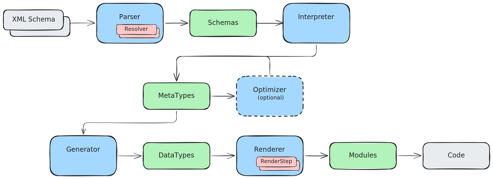

A comprehensive library for parsing XML schemas and generating code based on them.

This project originated as a fork of [`xsd-parser-rs`](https://github.com/lumeohq/xsd-parser-rs) but has since evolved into a complete rewrite.

> [!WARNING]
> This crate is currently in an unstable state. If you encounter any issues, please report them by filing an issue.

<a href="https://github.com/Bergmann89/xsd-parser/blob/master/LICENSE"></a> <a href="https://crates.io/crates/xsd-parser"></a> <a href="https://crates.io/crates/xsd-parser"></a> <a href="https://docs.rs/xsd-parser"></a> <a href="https://github.com/Bergmann89/xsd-parser/actions/workflows/main.yml"></a> <a href="https://deps.rs/repo/github/Bergmann89/xsd-parser"></a>


# Overview

The core idea of this library is to break down the code generation process into distinct steps, enabling better control and extensibility for users. The workflow is structured as follows:

1. **Parsing XML Schemas:**
    The [`Parser`] resolves XML schemas from various sources (e.g., local files, web links) and stores the processed information in the [`Schemas`] object.

1. **Interpreting Schemas:**
    The [`Interpreter`] uses the [`Schemas`] object to extract type information by applying extensions and restrictions defined in the schema. This results in a simplified [`Types`] structure that represents language-agnostic types.

1. **Optimizing Types:**
    The [`Optimizer`] refines the [`Types`] structure by applying various optimizations. This step is optional but may be necessary to handle specific features (e.g., `serde` support) when generating valid code.

1. **Generating Code:**
    Finally, the [`Generator`] converts the optimized [`Types`] information into Rust code.




This layered approach allows users to customize or extend the process at multiple stages. For example:
- Add custom logic to modify the type information.
- Replace the default generator with a custom implementation.
- Implement a custom interpreter to generate [`Types`] and use the default Rust code generator.

The possibilities for customization and extension are nearly limitless.


# Example

To quickly generate Rust code from an XML schema, you can use the [`generate`] function. This function acts as a simple wrapper for the entire process described above and is controlled via a [`Config`] structure to adjust various parameters.

```rust,ignore
use xsd_parser::{generate, Config, Error, config::{Schema, InterpreterFlags, OptimizerFlags, GenerateFlags}};

fn main() -> Result<(), Error> {
    let mut config = Config::default();
    config.parser.schemas = vec![Schema::File("my-schema.xsd".into())];
    config.interpreter.flags = InterpreterFlags::all();
    config.optimizer.flags = OptimizerFlags::all();
    config.generator.flags = GenerateFlags::all();

    let code = generate(config)?;
    println!("{code}");

    Ok(())
}
```


# Features

This library provides the following features:

- **Rust Code Generation:** Convert any XML schema into Rust code.
- **Layered Architecture:** Add user-defined code to manipulate type information or generated code.
- **User-Defined Types:** Inject existing types into the generated code to reuse predefined structures.
- **`serde` Support:** Generate code for serialization and deserialization using [`serde`](https://docs.rs/serde) with [`serde_xml`](https://docs.rs/serde-xml-rs) or [`quick_xml`](https://docs.rs/quick-xml) as serializer/deserializer.
- **`quick_xml` Support:** Direct serialization/deserialization support using [`quick_xml`](https://docs.rs/quick-xml), avoiding `serde` limitations and leveraging asynchronous features.


# Planned Features

- **Schema-Based Validation:** Generate validators directly from schemas to validate XML data during reading or writing.


# License

This crate is licensed under the MIT License.
